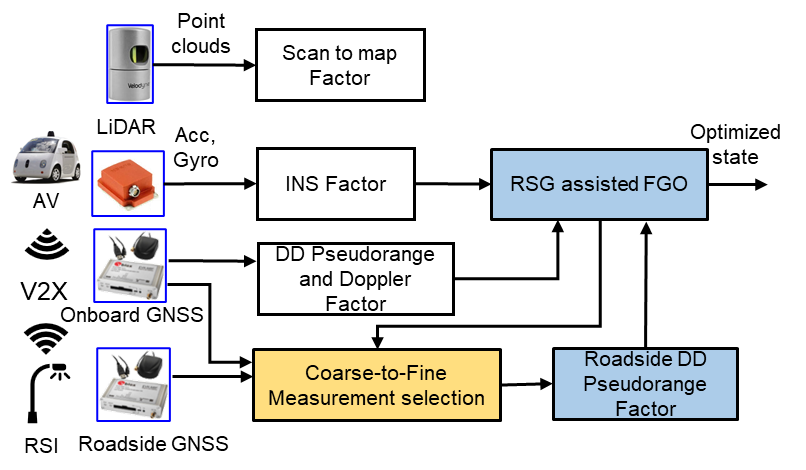
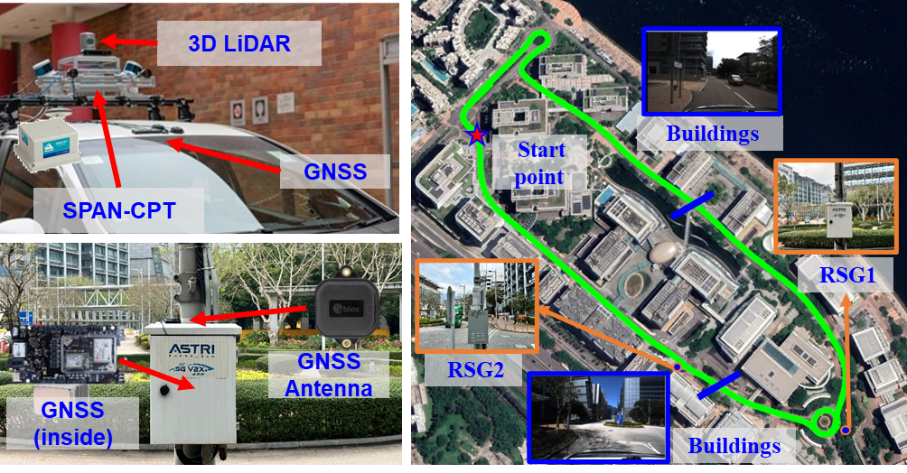

# Roadside GNSS Enhanced Multi-Sensor Integration for Intelligent Vehicles in Urban Areas

This repo will contains the data of  our submitted paper: **Roadside GNSS Enhanced Multi-Sensor Integration for Intelligent Vehicles in Urban Areas** . It is part of the project [V2X Cooperative Navigation](https://sites.google.com/view/v2x-cooperative-navigation).

  

## Videos:
Checkout our demo at [Video Link](https://youtu.be/zC7WAJiO9Mo)

## Sensor Setup

  

## Acknowledge
The authors would like to express their thanks to Xikun Liu and Alpamys Urtay for their kind help in this research. Thanks for [GLIO](https://github.com/XikunLiu-huskit/GLIO) (Liu, X., Wen, W., & Hsu, L. T. (2023). Glio: Tightly-coupled gnss/lidar/imu integration for continuous and drift-free state estimation of intelligent vehicles in urban areas. IEEE Transactions on Intelligent Vehicles.)
